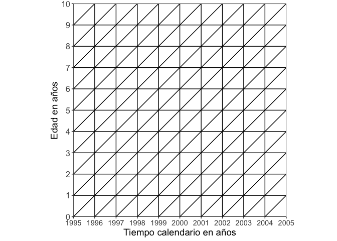
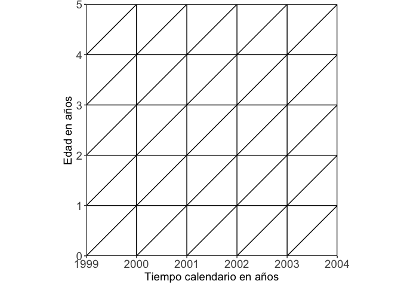
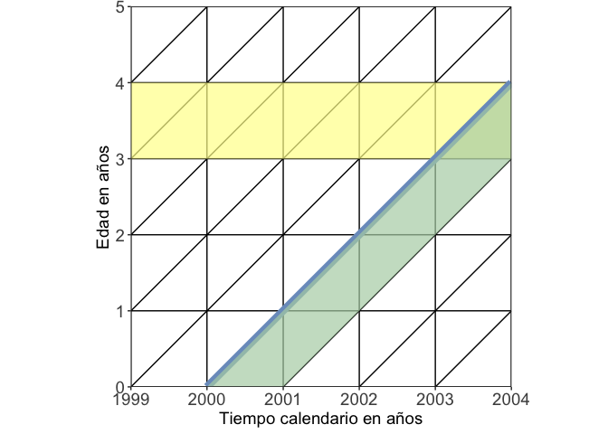
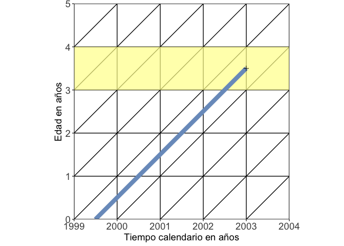
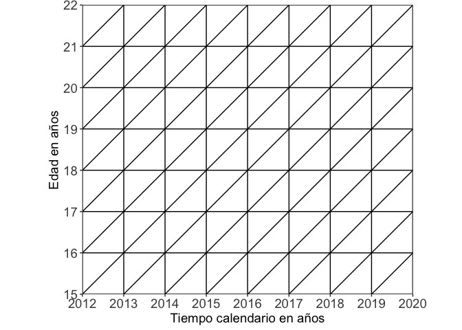
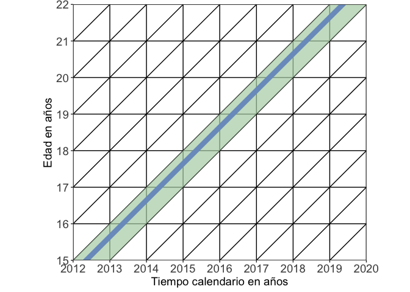
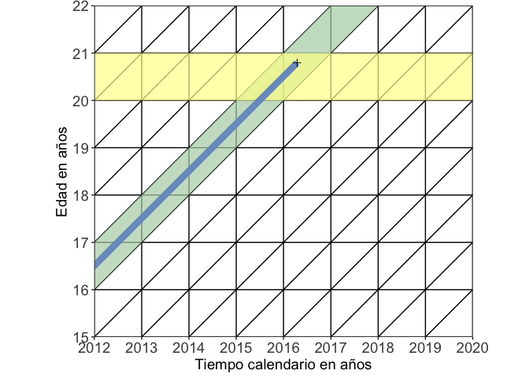
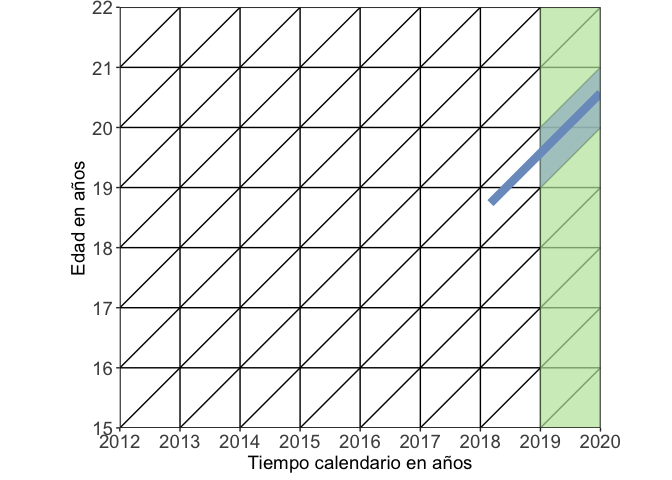

*Por Cristian Baeza Torres*

• 1 Defina las variables que toma en cuenta el diagrama de Lexis. (Eje
X, Eje Y) (2 ptos)  
*Respuesta* : El diagrama de lexis toma en cuenta dos variables **El
Tiempo** y **La duración del fenomeno que se quiere analizar**. En el
gráfico en el **Eje X** va el *Tiempo calendario en años* y en el **Eje
Y** va la *Edad en años*.

**Ejemplo:**

    ## ── Attaching packages ─────────────────────────────────────── tidyverse 1.3.0 ──

    ## ✓ ggplot2 3.3.3     ✓ purrr   0.3.4
    ## ✓ tibble  3.1.0     ✓ dplyr   1.0.5
    ## ✓ tidyr   1.1.3     ✓ stringr 1.4.0
    ## ✓ readr   1.4.0     ✓ forcats 0.5.1

    ## ── Conflicts ────────────────────────────────────────── tidyverse_conflicts() ──
    ## x dplyr::filter() masks stats::filter()
    ## x dplyr::lag()    masks stats::lag()

------------------------------------------------------------------------

• 2 Definir los conceptos de Cohorte y Línea de vida. (2 ptos)  
Cohorte: Marca el periodo de tiempo compartido en el nacimiento de los
miembros de una población, generalmente en años calendarios. Línea de
vida: Representa el curso de vida de un individuo dentro de una
población, indicando la entrada y la salida del mismo, abarca todo el
espacio temporal en el cual el individuo esta dentro de la población.

------------------------------------------------------------------------

• 3 ¿Qué implica la salida o entrada de un individuo en un diagrama de
Lexis? (3 ptos)  
La salida de un individuo significa que este salio de la población por
alguna causa como muerte o migración. Es decir, dejo de pertenecer a la
población. La entrada es lo contrario, es cuando un individuo nace o
entra (inmigrando) a la población.

------------------------------------------------------------------------

• 4 Dibuje un diagrama de Lexis desde el año 1999 al año 2004 partiendo
desde 0 a 5 años. (3 ptos)  

------------------------------------------------------------------------

• 5 Dibuje una línea de vida de un individuo que nació el 1 de enero del
2000. ¿Cuál es su Cohorte? ¿Qué edad tenia para el año 2003? (5 ptos)  
El Cohorte esta indicado en color verde y es el del año 2000. En el año
2003 tiene 3 años, ya que cumple años el 1 de enero.

------------------------------------------------------------------------

• 6 Dibuje una línea de vida de un individuo que nació el 1 de Julio de
1999 y salió de la población el 31 de diciembre del 2002. ¿A qué edad
salió el individuo de la población? (5 ptos)  
El individuo salió a los 2 años de la población.

------------------------------------------------------------------------

• 7 Dibuje un diagrama desde el año 2012 hasta el año 2020. Comenzando
de los 15 años hasta los 22. (5 ptos)  

------------------------------------------------------------------------

• 8 En el diagrama anterior, dibuje una línea de vida de un individuo
que nació el 10 de mayo de 1997. ¿Cuál es su cohorte? Marque en otro
color. ¿Qué edad tiene en el 2012? ¿Qué edad tiene al 2019? (5 ptos)  
R: Tiene 15 años en el 2012 y 21 en 2019. Su cohorte es el de 1997

------------------------------------------------------------------------

• 9 En el mismo diagrama, dibuje una línea de vida de un individuo que
nació el 30 de junio de 1995 y salió del grupo el 15 de abril del 2016.
Marque su cohorte. ¿Qué edad tenia cuando salió del grupo? Marque la
edad con otro color. (5 ptos)  
El individuo tenia 20 años cuando salio de la población y su cohorte
corresponde al del 1995.  

------------------------------------------------------------------------

• 10 Dibuje nuevamente el diagrama anterior, dibuje una línea de vida
que comienza en el momento que entro a la carrera de antropología. ¿Qué
edad tenia en segundo año? Marque con color. (5 ptos)

Esta pregunta depende del año de nacimiento del estudiante. Pero en
general si son de la generación 2018 y entraron con 18 años (nacieron el
año 1999) a la universidad debería verse así o al menos pertenecer al
rango marcado con azul, es decir, tener entre 19 a 20 años. Si nacieron
otro año o entraron en otra generación indicar. Al menos si entraton en
la generación 2018 debería estar dentro de la línea verde que indica el
año 2019.

------------------------------------------------------------------------

Dudas o consultas al mail del ayudante
**<a href="mailto:cbaeza2016@udec.cl" class="email">cbaeza2016@udec.cl</a>**
o
**<a href="mailto:crisbaezatorres@gmail.com" class="email">crisbaezatorres@gmail.com</a>**  
Los diagramas fueron realizados en R, si desea ver el código de este
elemento solicitarlo al mail.

------------------------------------------------------------------------
